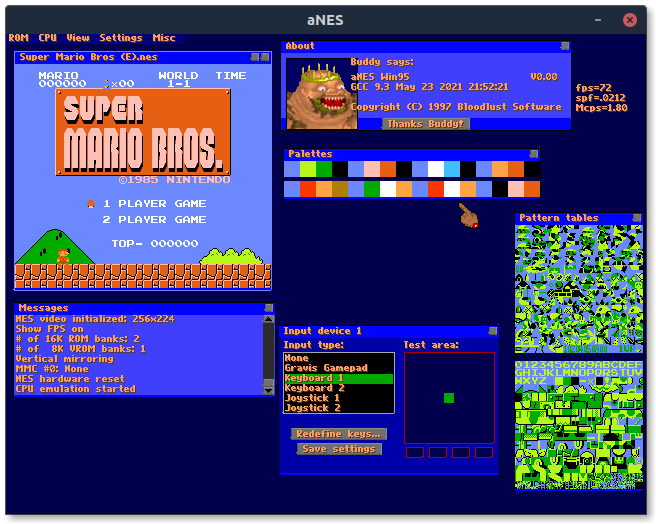

# NESticlePort
An experiment porting the leaked NESticle code (from 1997) released by [IamRifki](https://github.com/IamRifki/NESticle) to [SDL2](https://www.libsdl.org/).

_I only did this for fun/learning, I don't really know anything about NESticle -- it's older than me._

(I just added this readme as the project was poorly documented)

## Status

**NOTE: I am not actively working on this project! If you wish to continue it please do!**

I have the Emulator somewhat working!

Screenshot of Nesticle running on Ubuntu 20.04:




(compiled with g++ 9.3 as C++17!)

---

This is mostly using the original source code with some fixes, and some compiled code that was reverse engineered (as the released source was incomplete however there were compiled object files for the missing parts that were manually decompiled).

The SDL2 port works by adding another backend for the input/rendering. There already were backends for DOS and Windows 95, so adding SDL2 support just required implementing the relevant methods.

This build, however, does not use the original 6502 CPU emulator used in NESticle (since that was written in assembly and not portable -- or compatible with the Linux system I use). It was replaced with a C++ version (wrapped to use the same API) which allows this version of NESticle to be cross-platform. This 6502 emulator is included as a submodule.

If you want to get the true experience you get try getting the original 6502 emulator working (it's in `src-original/m6502/m6502.asm`) -- PRs welcome.

### What works

- The GUI and mouse input (mostly)
	- A bunch of the configs/settings/options in the menus seem to be functional
- Loading ROMs
- Running games (somewhat -- there's a lot of emulation issues)
  - Mainly rendering glitches

### What's left todo
  - Keyboard input/controls
  - Getting the emulator to a playable state
  - Probably more

### How to compile?

  Install SDL2 (dev) then run (using the included makefile)
  ```sh
  CC=g++ make nesticle  # note compiling the code as 64bit works!
  ./nesticle            # run the emulator (needs to be in the same folder as gui.vol and anes.pal)
  ```
  (this is on a Linux system I've yet to attempt building on windows but it should work with mingw64 -- there's no Linux specific code and SDL2 is cross-platform)

  **Note:** You need to use at least `g++-7` (from GCC 7) as I used C++17's ``std::filesystem`` to reimplement the ROM loader.

  **Note 2:** After cloning do `git submodule update --init --recursive` to download the mos6502 CPU emulator.
